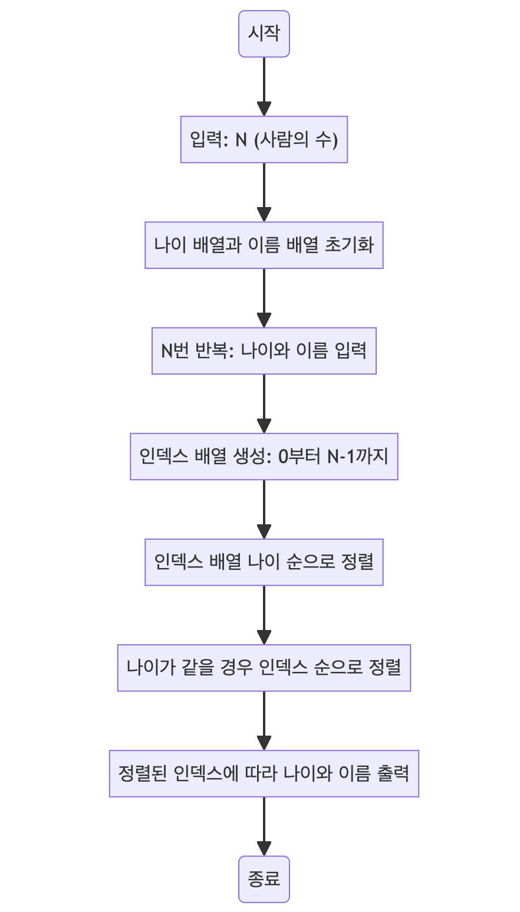

> [CH02_탐색_PART2](../) / [01_정렬](./)

# BOJ_10814 : 나이순 정렬
> https://www.acmicpc.net/problem/10814

## 설계
- 나이와 이름이 주어졌을 때 나이 순으로 정렬
    - 나이와 이름을 각각 별도의 배열에 저장한 후, 인덱스 배열을 사용하여 나이 순으로 정렬
    - 나이가 같은 경우에는 가입 순서(입력 순서)대로 정렬
    - 정렬된 순서대로 나이와 이름을 출력하여 최종 결과를 도출
- 이러한 접근 방식은 나이와 이름이 별도의 배열에 저장되어 있기 때문에, 인덱스를 사용하여 두 배열을 연결하는 방식으로 구현

## 구현


## 코드
### Java
```java
// package boj10814;

import java.util.*;
import java.util.stream.*;

public class Main {
    public static void main(String[] args) {
        Scanner sc = new Scanner(System.in);
        int N = sc.nextInt(); // 사용자로부터 사람의 수 N을 입력받음
        // System.out.println(N);

        // 나이와 이름을 저장할 배열 초기화
        int[] ages = new int[N];
        String[] names = new String[N];

        // N명의 나이와 이름을 입력받아 각 배열에 저장
        for (int i = 0; i < N; i++) {
            ages[i] = sc.nextInt(); // 나이 입력
            names[i] = sc.next(); // 이름 입력
        }
        sc.close(); // 스캐너 종료
        // System.out.println(Arrays.toString(ages));
        // System.out.println(Arrays.toString(names));

        // 각 사람의 인덱스를 저장하는 배열 생성
        Integer[] idxs = IntStream.range(0, N).boxed().toArray(Integer[]::new);

        // 인덱스 배열을 나이 순으로 정렬
        Arrays.sort(idxs, (a, b) -> {
            if (ages[a] == ages[b]) {
                // 나이가 같을 경우 인덱스 순으로 정렬 (가입 순서)
                return Integer.compare(a, b);
            }
            // 나이가 다를 경우 나이 순으로 정렬
            return Integer.compare(ages[a], ages[b]);
        });
        // System.out.println(Arrays.toString(idxs));

        // 정렬된 인덱스에 따라 나이와 이름 출력
        for (int i : idxs) {
            System.out.println(ages[i] + " " + names[i]);
        }
    }
}
```

### Python
```python
# 사용자로부터 사람의 수 N을 입력받음
N = int(input())
# print(N)

# 각 사람의 인덱스, 나이, 이름을 저장할 리스트
# 인덱스는 입력 순서를 나타내며, 나중에 정렬 기준으로 사용됨
data = [[i, *input().split()] for i in range(N)]
# print(data)

# data 리스트를 정렬
# 첫 번째 기준은 나이(정수 변환 필요), 두 번째 기준은 입력 순서(인덱스)
data.sort(key=lambda x: (int(x[1]), x[0]))
# print(data)

# 정렬된 데이터 출력
for d in data:
    print(f'{d[1]} {d[2]}') # 나이와 이름 출력
```