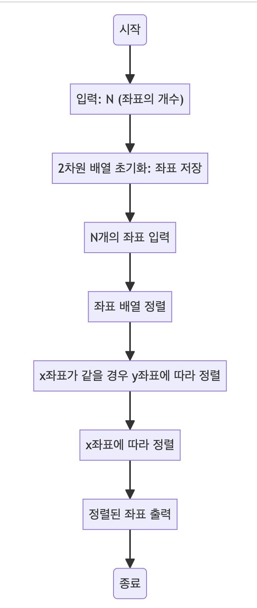

> [CH02_탐색_PART2](../) / [01_정렬](./)

# BOJ_11650 : 좌표 정렬하기
> https://www.acmicpc.net/problem/11650

## 설계
- 2차원 좌표를 입력받아 x좌표가 증가하는 순으로, x좌표가 같을 경우 y좌표가 증가하는 순으로 정렬
- Arrays.sort 메소드와 람다식을 사용하여 좌표를 정렬
- 먼저 x좌표에 따라 정렬하고, x좌표가 같은 경우에는 y좌표에 따라 정렬
- 정렬된 좌표는 반복문을 통해 출력

## 구현


## 코드
### Java
```java
// package boj11650;

import java.util.Arrays;
import java.util.Scanner;

public class Main {
    public static void main(String[] args) {      
        Scanner sc = new Scanner(System.in);

        // 사용자로부터 좌표의 개수 N을 입력받음
        int N = sc.nextInt();

        // 좌표를 저장할 2차원 배열 초기화
        int[][] arr = new int[N][2];

        // N개의 좌표를 입력받아 배열에 저장
        for(int i = 0; i < N; i++) {
            arr[i][0] = sc.nextInt(); // x좌표
            arr[i][1] = sc.nextInt(); // y좌표
        }
        // System.out.println(Arrays.deepToString(arr));
        sc.close(); // 스캐너 종료

        // 좌표 배열을 정렬
        Arrays.sort(arr, (a, b) -> {
            if(a[0] == b[0]) {
                // x좌표가 같을 경우 y좌표에 따라 정렬
                return a[1] - b[1];
            }
            else {
                // x좌표에 따라 정렬
                return a[0] - b[0];
            }
        });

        // 정렬된 좌표 출력
        for(int i = 0; i < N; i++) {
            System.out.println(arr[i][0] + " " + arr[i][1]);
        }
    }
}
```

### Python
```python
# 사용자로부터 좌표의 개수 N을 입력받음
N = int(input())

# 좌표를 저장할 리스트 초기화 및 입력 받기
arr = [list(map(int, input().split())) for _ in range(N)]

# 입력받은 좌표 출력 (디버깅용)
# print(arr)

# 좌표 리스트를 정렬
# x좌표에 따라 오름차순 정렬, x좌표가 같을 경우 y좌표에 따라 오름차순 정렬
arr.sort(key=lambda x: (x[0], x[1]))

# 정렬된 좌표 출력
for v in arr:
    print(*v) # 리스트의 각 요소를 공백으로 구분하여 출력
```