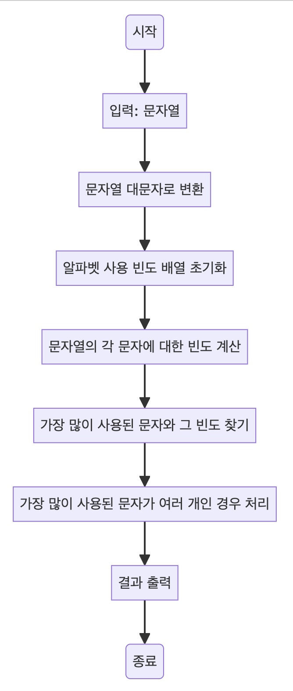

> [CH02_탐색_PART2](../) / [02_문자열](./)

# BOJ_1157 : 단어 공부
> https://www.acmicpc.net/problem/1157

## 설계
- 입력된 문자열에서 가장 많이 사용된 알파벳 문자를 찾고, 만약 가장 많이 사용된 문자가 여러 개라면 물음표(?)를 출력합니다.
- 각 문자의 빈도를 계산하기 위해 `int` 배열을 사용합니다. 
- 각 문자는 'A'에서 'Z' 사이의 값으로 변환되어 해당 인덱스의 빈도를 증가시킵니다.
- 이후 가장 빈도가 높은 문자를 찾고, 동일한 빈도를 가진 다른 문자가 존재하는 경우 물음표(?)를 출력합니다. 

## 구현


## 코드
### Java
```java
// package boj1157;

import java.util.*;

public class Main {
    public static void main(String[] args) {
        Scanner sc = new Scanner(System.in);

        // 반복적으로 문자열을 입력받음
        while (sc.hasNext()) {
            String text = sc.next().toUpperCase(); // 입력된 문자열을 대문자로 변환
            findMostUsedCharacter(text); // 가장 많이 사용된 문자 찾기
        }
        sc.close(); // Scanner 객체 종료
    }// 가장 많이 사용된 문자를 찾는 메서드

    public static void findMostUsedCharacter(String text) {
        // 알파벳 별 사용 빈도를 저장할 배열 초기화
        int[] count = new int[26];

        // 문자열의 각 문자에 대해 빈도 계산
        for (int i = 0; i < text.length(); i++) {
            int num = text.charAt(i) - 'A'; // 문자를 정수로 변환 (A = 0, B = 1, ...)
            count[num]++; // 해당 문자의 빈도 증가
        }

        // 가장 많이 사용된 문자의 빈도와 그 문자를 저장할 변수
        int max = 0; // 가장 많이 사용된 문자의 빈도
        char answer = '?'; // 가장 많이 사용된 문자

        // 가장 많이 사용된 문자 탐색
        for (int i = 0; i < count.length; i++) {
            if (max < count[i]) {
                max = count[i]; // 최대 빈도 갱신
                answer = (char) (i + 'A'); // 해당 문자 저장
            } else if (max == count[i]) {
                answer = '?'; // 가장 많이 사용된 문자가 여러 개인 경우
            }
        }

        // 결과 출력
        System.out.println(answer);
    }
}
```

### Python
```python
def find_most_used_character(text):
    # 알파벳 별 사용 빈도를 저장할 배열 초기화
    count = [0] * 26

    # 문자열의 각 문자에 대해 대문자로 변환 후 빈도 계산
    for t in text.upper():
        count[ord(t) - ord('A')] += 1  # ord() 함수를 사용해 문자를 ASCII 값으로 변환

    # 가장 많이 사용된 문자의 빈도와 그 문자를 저장할 변수
    _max = 0  # 가장 많이 사용된 문자의 빈도
    answer = '?'  # 가장 많이 사용된 문자

    # 가장 많이 사용된 문자 탐색
    for i in range(len(count)):
        if (_max < count[i]):
            _max = count[i]  # 최대 빈도 갱신
            answer = chr(i + ord('A'))  # 해당 문자 저장 (ASCII 값으로부터 문자 변환)
        elif _max == count[i]:
            answer = '?'  # 가장 많이 사용된 문자가 여러 개인 경우

    # 결과 출력
    print(answer)

# 사용자로부터 문자열 입력받아 함수 실행
find_most_used_character(input())
```