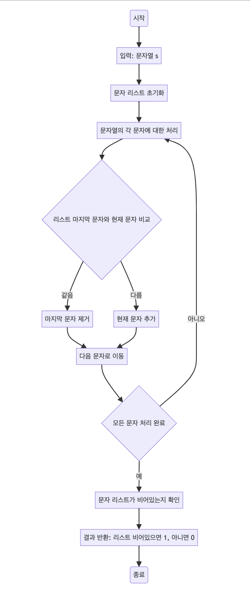

> [CH02_탐색_PART2](../) / [02_문자열](./)

# 프로그래머스 : 짝지어 제거하기
> https://school.programmers.co.kr/learn/courses/30/lessons/12973

## 설계
- 문자열에서 같은 알파벳이 연속으로 나타나는 쌍을 제거
- 주어진 문자열 s를 순회하면서, 각 문자를 리스트에 추가
- 리스트에 이미 문자가 있고, 그 문자가 현재 문자와 같으면 연속된 쌍이므로 리스트에서 마지막 문자를 제거
- 문자열의 모든 문자를 처리한 후, 리스트가 비어 있으면 모든 연속 쌍이 제거된 것이므로 1을 반환하고, 그렇지 않으면 0을 반환

## 구현


## 코드
### Java
```java
// package pg12973;

import java.util.*;

public class Solution {
    // public static void main(String[] args) {
    //     Solution solution = new Solution();
    //     String s = "baabaa"; // 테스트할 문자열
    //     // String s = "cdcd"; // 다른 테스트 케이스
    //     System.out.println(solution.solution(s)); // 결과 출력   
    // }

    public int solution(String s) {
        // 문자를 저장할 리스트
        List<Character> list = new ArrayList<>();
        for (char c : s.toCharArray()) {
            // 리스트가 비어있지 않고 마지막 문자가 현재 문자와 같다면
            if (list.size() > 0 && list.get(list.size() - 1) == c) {
                list.remove(list.size() - 1); // 마지막 문자 제거
                continue;
            }
            list.add(c); // 현재 문자 추가
            // System.out.println(list); // 리스트 상태 출력 (디버깅용)
        }
        // 모든 문자가 제거되었는지 확인
        int answer = list.size() == 0 ? 1 : 0; // 리스트가 비어있으면 1, 아니면 0 반환
        return answer;
    }
}
```
### Python
```python
def solution(s):
    _list = []  # 문자를 저장할 리스트 초기화
    for c in s:
        # 리스트가 비어있지 않고 마지막 문자가 현재 문자와 같다면
        if _list and _list[-1] == c:
            _list.pop(-1)  # 마지막 문자 제거
            continue
        _list.append(c)  # 현재 문자 추가
        print(_list)  # 리스트 상태 출력 (디버깅용)
    # 모든 문자가 제거되었는지 확인
    return 0 if len(_list) else 1  # 리스트가 비어있으면 1, 아니면 0 반환

# 테스트할 문자열
s = 'baabaa'
# s = 'cdcd'
print(solution(s)) # 결과 출력
```