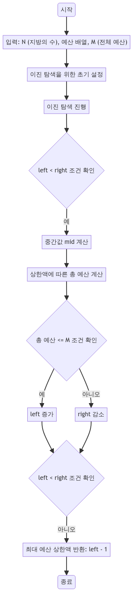

> [CH02_탐색_PART2](../) / [03_이진탐색](./)

# BOJ_2512 : 예산
> https://www.acmicpc.net/problem/2512

## 설계
- 이진 탐색(Binary Search)을 사용하여 예산 문제를 해결. 각 지방의 예산 요청을 받아 총 예산 범위 내에서 가능한 최대의 예산 상한액을 찾음.
- 예산의 최댓값을 초과하지 않는 범위에서 가능한 가장 큰 상한액을 찾아내는 것이 목표
- 탐색 범위를 절반씩 줄여나가면서 빠르게 최적의 해를 찾음

## 구현


## 코드
### Java
```java
// package boj2512;

import java.util.*;
import java.io.*;

public class Main {
    public static void main(String[] args) {
        Scanner sc = new Scanner(System.in);

        // 지방의 수 N을 입력받음 (3 이상 10,000 이하)
        int N = sc.nextInt(); 
        // 각 지방의 예산 요청을 저장할 배열
        int[] budget = new int[N];
        for (int i = 0; i < N; i++) {
            // 각 지방의 예산 요청 (1 이상 100,000 이하)
            budget[i] = sc.nextInt();
        }
        // 전체 예산 M을 입력받음
        int M = sc.nextInt(); 
        sc.close();

        // 이진 탐색을 통해 최대 예산 상한액을 계산
        System.out.println(binarySearch(budget, M));
    }

    // 이진 탐색을 수행하는 메서드
    public static int binarySearch(int[] budget, int M) {
        int left = 0; // 탐색 범위의 좌측 경계
        // 탐색 범위의 우측 경계는 예산 중 최대값 + 1
        int right = Arrays.stream(budget).max().getAsInt() + 1;

        while (left < right) {
            int mid = (left + right) / 2; // 중간값을 상한액으로 가정
            int sum = 0; // 상한액에 따른 총 예산 계산

            // 각 지방의 예산과 상한액을 비교하여 총 예산 계산
            for (int i = 0; i < budget.length; i++) {
                sum += Math.min(budget[i], mid);
            }

            // 총 예산이 전체 예산 M보다 작거나 같으면 상한액을 높임
            if (sum <= M) {
                left = mid + 1;
            } else {
                // 총 예산이 전체 예산 M보다 크면 상한액을 낮춤
                right = mid;
            }
        }

        // 상한액 좌측이 우측보다 크거나 같아지면 탐색 종료
        // -1을 하는 이유는 현재의 left가 실제 상한액보다 1 큰 값이므로
        return left - 1;
    }
}
```

### Python
```python
# 지방의 수 N을 입력받음
N = int(input())
# 각 지방의 예산 요청을 입력받아 리스트에 저장
budget = list(map(int, input().split()))          
# print(budget)  # 입력받은 예산 리스트 출력 (디버깅용)
# 전체 예산 M을 입력받음
M = int(input())

# 이진 탐색을 위한 좌측 경계 초기화
left = 0
# 이진 탐색을 위한 우측 경계는 예산 중 최대값 + 1로 설정
right = max(budget) + 1
# print(right)  # 계산된 우측 경계 출력 (디버깅용)

# 이진 탐색 시작
while left < right:
    mid = (left + right) // 2  # 중간값을 상한액으로 가정
    # print(mid)  # 계산된 중간값 출력 (디버깅용)

    # 상한액에 따른 총 예산 계산
    _sum = sum([min(b, mid) for b in budget])
    # print(_sum)  # 계산된 총 예산 출력 (디버깅용)

    # 총 예산이 전체 예산 M보다 작거나 같으면 상한액을 높임
    if _sum <= M:
        left = mid + 1
    else:
        # 총 예산이 전체 예산 M보다 크면 상한액을 낮춤
        right = mid

# 탐색 종료 후 상한액 출력
# -1을 하는 이유는 현재의 left가 실제 상한액보다 1 큰 값이므로
print(left - 1)
```