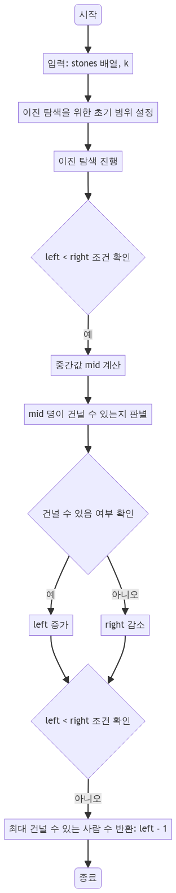

> [CH02_탐색_PART2](../) / [03_이진탐색](./)

# 프로그래머스 : 징검다리 건너기
> https://school.programmers.co.kr/learn/courses/30/lessons/64062

## 설계
- 징검다리의 돌들이 일정 인원이 건널 때마다 내구도가 감소할 때, 건너뛸 수 있는 조건 하에 최대 몇 명까지 건널 수 있는지를 구함
- 일반적인 완전탐색 방식: 모든 가능한 사람 수에 대해 징검다리를 건널 수 있는지 확인합니다.
    - 가능한 사람 수는 최대 200000000이므로, 시간 복잡도는 O(N * 200000000)가 되어 비효율적입니다.
- 이진 탐색 방식:
    - 이진 탐색을 사용하여 징검다리를 건널 수 있는 최대 인원을 찾습니다.
    - 각 이진 탐색 단계에서 canCross 함수는 O(N)의 시간 복잡도를 가집니다.
    - 이진 탐색은 탐색 범위를 절반으로 줄여나가므로, log(200000000) 번의 반복으로 최적해를 찾습니다.
    - 따라서 전체 시간 복잡도는 O(N * log(200000000))가 되어 훨씬 더 효율적입니다.

## 구현


## 코드
### Java
```java
// package pg64062;
// https://school.programmers.co.kr/learn/courses/30/lessons/64062
import java.util.*;
import java.io.*;

// public class Main {
//     public static void main(String[] args) {
//         int[] stones = {2, 4, 5, 3, 2, 1, 4, 2, 5, 1};
//         int k = 3;
//         Solution sol = new Solution();
//         System.out.println(sol.solution(stones, k));
//     }
// }

class Solution {
    public int solution(int[] stones, int k) {
        // 이진 탐색을 위한 초기 범위 설정
        int left = 1, right = 200000000;

        // 이진 탐색 시작
        while (left < right) {
            int mid = (left + right) / 2; // 중간값 계산
            if (canCross(stones, k, mid)) {
                // mid 명이 건널 수 있다면 left 증가
                left = mid + 1;
            } else {
                // mid 명이 건널 수 없다면 right 감소
                right = mid;
            }
        }
        return left - 1; // 최대 건널 수 있는 사람 수 반환
    }

    // mid 명이 징검다리를 건널 수 있는지 판별하는 함수
    public boolean canCross(int[] stones, int k, int mid) {
        int cnt = 0;
        for (int i = 0; i < stones.length; i++) {
            if (stones[i] < mid) {
                cnt++; // 연속된 돌이 mid 명을 견딜 수 없는 경우
            } else {
                cnt = 0; // 견딜 수 있는 경우 카운터 리셋
            }
            if (cnt >= k) {
                return false; // 연속된 k개 돌이 mid 명을 견디지 못함
            }
        }
        return true; // 건널 수 있음
    }
}
```
### Python
```python
def solution(stones, k):
    # 이진 탐색을 위한 초기 범위 설정
    left = 1
    right = 200_000_000  # 충분히 큰 수로 설정

    # 이진 탐색 시작
    while left < right:
        mid = (left + right) // 2  # 중간값 계산
        if can_cross(stones, k, mid):
            # mid 명이 건널 수 있다면 left 증가
            left = mid + 1
        else:
            # mid 명이 건널 수 없다면 right 감소
            right = mid

    # 최대 건널 수 있는 사람 수 반환
    return left - 1

# mid 명이 징검다리를 건널 수 있는지 판별하는 함수
def can_cross(stones, k, mid):
    cnt = 0
    for s in stones:
        if s < mid:
            # 연속된 돌이 mid 명을 견딜 수 없는 경우
            cnt += 1
        else:
            # 견딜 수 있는 경우 카운터 리셋
            cnt = 0
        if cnt >= k:
            # 연속된 k개 돌이 mid 명을 견디지 못함
            return False

    return True  # 건널 수 있음

# 테스트 코드
# stones = [2, 4, 5, 3, 2, 1, 4, 2, 5, 1]
# k = 3
# print(solution(stones, k))
```