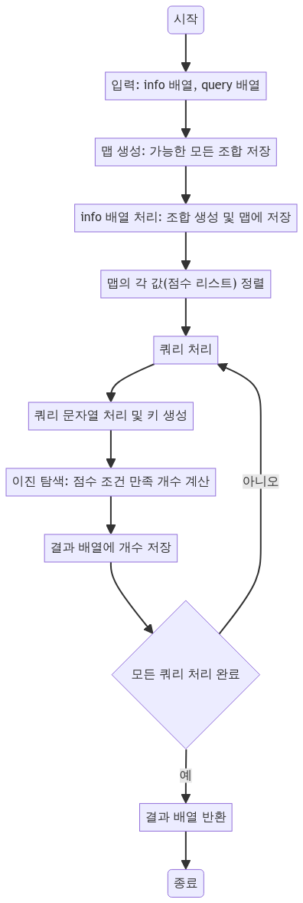

> [CH02_탐색_PART2](../) / [03_이진탐색](./)

# 프로그래머스 : 순위 검색
> https://school.programmers.co.kr/learn/courses/30/lessons/72412

## 설계
- 브루트 포스로 가능한 모든 조건의 조합을 생성하고, 이진 탐색을 통해 효율적으로 해당 조건을 만족하는 지원자 수를 찾아냄
- 각 info 문자열에 대해 가능한 모든 조건의 조합을 생성하고, 해당 조건에 해당하는 점수를 Map에 저장
- Map의 각 값(점수 리스트)를 오름차순으로 정렬
- 각 query에 대해 해당 조건을 만족하는 점수의 개수를 찾기 위해 이진 탐색을 사용
- 이진 탐색을 통해 주어진 점수 조건을 만족하는 지원자의 수를 계산하여 결과 배열에 저장

## 구현


## 코드
### Java
```java
// package pg72412;

// https://school.programmers.co.kr/learn/courses/30/lessons/72412
import java.util.*;
import java.io.*;

// public class Main {
//     public static void main(String[] args) {
//         String[] info = { "java backend junior pizza 150", "python frontend senior chicken 210",
//                 "python frontend senior chicken 150", "cpp backend senior pizza 260",
//                 "java backend junior chicken 80", "python backend senior chicken 50" };
//         String[] query = { "java and backend and junior and pizza 100",
//                 "python and frontend and senior and chicken 200", "cpp and - and senior and pizza 250",
//                 "- and backend and senior and - 150", "- and - and - and chicken 100",
//                 "- and - and - and - 150" };
//         Solution sol = new Solution();
//         System.out.println(Arrays.toString(sol.solution(info, query)));
//     }
// }

class Solution {
    // 주어진 info와 query를 기반으로 쿼리에 해당하는 정보 개수를 반환하는 메서드
    public int[] solution(String[] info, String[] query) {
        int[] answer = new int[query.length];
        Map<String, List<Integer>> map = new HashMap<>();

        // info 문자열을 처리하여 가능한 모든 조합을 맵에 저장
        for (String s : info) {
            String[] str = s.split(" ");
            int score = Integer.parseInt(str[4]);
            generateCombinations(str, score, 0, "", map);
        }

        // 맵의 각 값(점수 리스트)를 정렬
        for (Map.Entry<String, List<Integer>> entry : map.entrySet()) {
            entry.getValue().sort(null);
        }

        // 쿼리 처리
        for (int i = 0; i < query.length; i++) {
            String[] str = query[i].replaceAll("-", "").split(" and | ");
            int score = Integer.parseInt(str[4]);
            String key = String.join("", str[0], str[1], str[2], str[3]);
            List<Integer> list = map.getOrDefault(key, new ArrayList<>());
            
            // 이진 탐색을 사용하여 점수 조건을 만족하는 개수 계산
            int s = 0, e = list.size();
            while (s < e) {
                int mid = (s + e) / 2;
                if (list.get(mid) < score) {
                    s = mid + 1;
                } else {
                    e = mid;
                }
            }
            answer[i] = list.size() - s;
        }
        return answer;
    }

    // 조합을 생성하고 맵에 저장하는 메서드
    public void generateCombinations(String[] str, int score, int index, String current, Map<String, List<Integer>> map) {
        if (index == str.length) {
            map.computeIfAbsent(current, k -> new ArrayList<>()).add(score);
            return;
        }
        // 현재 원소를 포함하는 경우
        generateCombinations(str, score, index + 1, current + str[index], map);
        // 현재 원소를 포함하지 않는 경우
        generateCombinations(str, score, index + 1, current, map);
    }
}
```
### Python
```python
# from pprint import pprint

# info = ["java backend junior pizza 150",
#         "python frontend senior chicken 210",
#         "python frontend senior chicken 150",
#         "cpp backend senior pizza 260",
#         "java backend junior chicken 80",
#         "python backend senior chicken 50"]
# query = ["java and backend and junior and pizza 100",
#          "python and frontend and senior and chicken 200",
#          "cpp and - and senior and pizza 250",
#          "- and backend and senior and - 150",
#          "- and - and - and chicken 100",
#          "- and - and - and - 150"]

# 주어진 info와 query를 기반으로 쿼리에 해당하는 지원자 수를 반환하는 함수
def solution(info, query):
    # pprint(info)  # 정보 출력 (디버깅용)
    # pprint(query)  # 쿼리 출력 (디버깅용)
    answer = []
    _map = {}  # 각 조건에 해당하는 점수 리스트를 저장할 딕셔너리

    # info 데이터 처리
    for el in info:
        *data, score = el.split()  # 데이터 분리
        recursive(data, score, 0, '', _map)  # 가능한 모든 조합 생성

    # 딕셔너리의 각 값(점수 리스트)를 정렬
    for v in _map.values():
        v.sort()

    # 쿼리 처리
    for i in range(len(query)):
        *q, score = query[i].split()  # 쿼리 분리
        k = ''.join([v for v in q if v not in ['and', '-']])  # 필요한 조건만 추출
        scores = _map.get(k, [])  # 해당 조건에 맞는 점수 리스트 가져오기
        answer.append(binary_search(int(score), scores))  # 이진 탐색으로 지원자 수 계산

    return answer

# 조합을 생성하고 딕셔너리에 저장하는 함수
def recursive(data, score, index, current, _map):
    if index == len(data):
        if current not in _map:
            _map[current] = []
        _map[current].append(int(score))
        return
    recursive(data, score, index + 1, current + data[index], _map)
    recursive(data, score, index + 1, current, _map)

# 이진 탐색을 수행하는 함수
def binary_search(score, scores):
    left = 0
    right = len(scores)
    while left < right:
        mid = (left + right) // 2
        if scores[mid] < score:
            left = mid + 1
        else:
            right = mid
    return len(scores) - left

# 결과 출력
# pprint(solution(info, query))
```