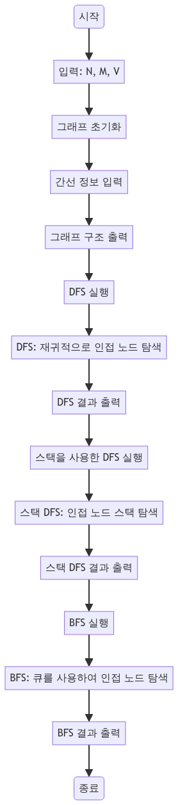

> [CH03_그래프_탐색](../) / [01_그래프_탐색](./)

# BOJ_1260 : DFS와 BFS
> https://www.acmicpc.net/problem/1260

## 설계
- DFS와 BFS는 그래프를 탐색하는 두 가지 기본적인 방법으로, 각각의 방식으로 그래프의 노드들을 방문하고 탐색하는 과정을 나타냄
- DFS는 가능한 한 깊이 들어가 노드를 탐색하는 방법이고, BFS는 같은 레벨의 노드를 먼저 탐색하는 방식
- DFS는 재귀 호출과 스택을 사용한 두 가지 방식으로 구현할 수 있으며, BFS는 큐를 사용하여 구현

## 구현


## 코드
### Java
```java
// package boj1260;

// https://www.acmicpc.net/problem/1260
import java.util.*;
import java.io.*;

public class Main {

    public static void main(String[] args) throws Exception {
        BufferedReader br = new BufferedReader(
                new InputStreamReader(System.in));
        StringTokenizer st = new StringTokenizer(br.readLine());
        int N = Integer.parseInt(st.nextToken());
        int M = Integer.parseInt(st.nextToken());
        int V = Integer.parseInt(st.nextToken());

        graph = new boolean[N + 1][N + 1]; // 정점의 개수 + 1만큼

        for (int i = 0; i < M; i++) { // 간선의 개수만큼 반복
            st = new StringTokenizer(br.readLine());
            int a = Integer.parseInt(st.nextToken());
            int b = Integer.parseInt(st.nextToken());
            graph[a][b] = true; // a와 b에 연결(간선)이 존재한다
            graph[b][a] = true; // b와 a에 연결(간선)이 존재한다
        }
        visit = new boolean[N + 1]; // 정점의 수만큼 방문을 나타내는 배열
        sb = new StringBuilder(); // 방문한 노드들
        // dfs(V);
        // System.out.println(sb); // 1 2 4 3 (DFS 방문)
        dfs2(V);
        System.out.println(sb); // 1 2 4 3 (DFS 방문)
        visit = new boolean[N + 1]; // 정점의 수만큼 방문을 나타내는 배열
        sb = new StringBuilder(); // 방문한 노드들
        bfs(V);
        System.out.println(sb); // 1 2 3 4 (BFS 방문)
    }

    static boolean[] visit;
    static boolean[][] graph;
    static StringBuilder sb;

    static void dfs(int node) { // 이제 dfs를 통해서 방문한 노드
        visit[node] = true; // 0 -> 방문 안했다 (초기값-빈 int배열을 만들면 0으로 가득 차있음)
        sb.append(node);
        sb.append(' ');
        for (int i = 1; i < graph[node].length; i++) { // 그래프 배열을 탐색해서
            if (graph[node][i] && !visit[i]) {
                dfs(i); // 인덱스가 곧 정점 이름과 매치되어 있음 -> 어떤 조건에서 dfs
            }
        }
    }

    static void dfs2(int node) { // 스택 방식으로 처리
        Stack<Integer> stack = new Stack<>(); // 탐색할 노드들을 반복적으로 여기에 추가...
        stack.push(node);
        while (!stack.isEmpty()) { // stack이 비어있지 않다면 계속 진행
            int nextNode = stack.pop();
            if (visit[nextNode]) {
                continue; // 이미 방문된 노드라면 다음 노드로...
            } else {
                visit[nextNode] = true; // 신규 방문이라면 1을 표시
            }
            sb.append(nextNode);
            sb.append(' ');
            for (int i = graph[nextNode].length - 1; i >= 1; i--) { // 그래프 배열을 탐색해서
                if (!graph[nextNode][i]) { // 탐색하면 안되는 조건 (2)
                    continue; // 간선이 존재하지 않는 경우에 대해서 continue;
                }
                stack.push(i); // 다음 간선으로 연결되어 있는 노드들을 일괄 추가해주고...
            }
        }
    }

    static void bfs(int node) { // 큐 방식으로 처리
        Queue<Integer> queue = new ArrayDeque<>(); // 탐색할 노드들을 반복적으로 여기에 추가...
        queue.add(node);
        while (!queue.isEmpty()) { // stack이 비어있지 않다면 계속 진행
            int nextNode = queue.poll(); // 얘가 핵심! -> 선입선출 (같은 레벨의 이전 노드들을 우선탐색)
            if (visit[nextNode]) {
                continue; // 이미 방문된 노드라면 다음 노드로...
            } else {
                visit[nextNode] = true; // 신규 방문이라면 1을 표시
            }
            sb.append(nextNode);
            sb.append(' ');
            for (int i = 1; i <= graph[nextNode].length - 1; i++) { // 그래프 배열을 탐색해서
                if (!graph[nextNode][i]) { // 탐색하면 안되는 조건 (2)
                    continue; // 간선이 존재하지 않는 경우에 대해서 continue;
                }
                queue.add(i); // 큐 방식으로 변환
            }
        }
    }
}
```

### Python
```python
from collections import deque
import sys
from pprint import pprint
input = lambda: sys.stdin.readline().rstrip()

# 그래프의 노드 수(N), 간선 수(M), 시작 노드(V) 입력 받기
N, M, V = map(int, input().split())

# 그래프 초기화 (인접 행렬 방식)
graph = [[False] * (N+1) for _ in range(N+1)]

# 간선 정보 입력 받아 그래프에 저장
for i in range(M):
    a, b = map(int, input().split())
    graph[a][b] = True
    graph[b][a] = True

# 그래프 구조 출력 (디버깅 용도)
pprint(graph)

# 깊이 우선 탐색 (DFS) 함수 정의
def dfs(node, visit):
    visit[node] = True  # 현재 노드 방문 처리
    print(node, end=' ')
    for i in range(1, len(visit)):
        if graph[node][i] and not visit[i]:
            dfs(i, visit)  # 연결된 노드로 재귀 호출

# 스택을 사용한 DFS 함수 정의
def dfs2(node, visit):
    stack = deque()
    stack.append(node)
    while stack:
        next_node = stack.pop()
        if visit[next_node]: continue
        visit[next_node] = True
        print(next_node, end=' ')
        for i in range(len(visit)-1, 0, -1):
            if not graph[next_node][i]: continue
            stack.append(i)  # 연결된 노드를 스택에 추가

# 너비 우선 탐색 (BFS) 함수 정의
def bfs(node, visit):
    queue = deque()
    queue.appendleft(node)
    while queue:
        next_node = queue.pop()
        if visit[next_node]: continue
        visit[next_node] = True
        print(next_node, end=' ')
        for i in range(1, len(visit)):
            if not graph[next_node][i] : continue
            queue.appendleft(i)  # 연결된 노드를 큐에 추가

# 각 탐색 알고리즘 실행
dfs(V, [False] * (N+1))  # DFS 실행
print()
dfs2(V, [False] * (N+1)) # 스택을 사용한 DFS 실행
print()
bfs(V, [False] * (N+1))  # BFS 실행
```