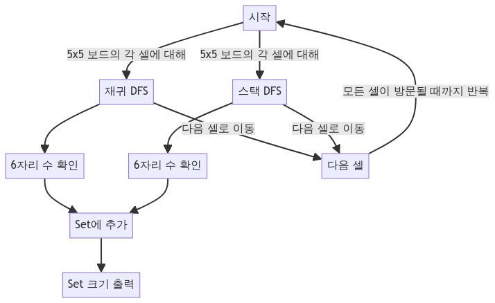

> [CH03_그래프_탐색](../) / [02_DFS](./)

# BOJ_2210 : 숫자판 탐색
> https://www.acmicpc.net/problem/2210

## 설계
- 5x5 숫자판 위에서 임의의 위치에서 시작해 상하좌우로 이동하면서 만들 수 있는 모든 6자리 수의 개수를 찾음
- 두 가지 방식으로 깊이 우선 탐색(DFS)을 구현하여 문제를 해결(재귀를 사용한 방식과 스택을 사용한 방식)
- 모든 시작점에 대해 상하좌우로 이동하며 6자리 수를 만들고, 중복되지 않는 수들을 set에 저장하여 최종적으로 set의 크기를 출력
- 재귀 방식과 스택 방식 모두 각 위치에서 가능한 모든 경로를 탐색하여 문제를 해결 : 재귀 방식은 메서드 호출 스택을 사용하여 탐색을 진행하는 반면, 스택 방식은 명시적인 Stack 객체를 사용하여 동일한 작업을 수행합니다.

## 구현


## 코드
### Java
```java
// package boj2210;

// https://www.acmicpc.net/problem/2210
import java.util.*;
import java.io.*;

public class Main {
    // 5x5 숫자판
    static int[][] board = new int[5][5];
    // 중복되지 않는 6자리 수를 저장할 HashSet
    static Set<Integer> set = new HashSet<>();
    
    public static void main(String[] args) {
        Scanner sc = new Scanner(System.in);
        // 숫자판 입력
        for (int i = 0; i < 5; i++) {
            String[] line = sc.nextLine().split(" ");
            for (int j = 0; j < 5; j++) {
                board[i][j] = Integer.parseInt(line[j]);
            }
        }
        sc.close();
        // 모든 시작점에 대해 DFS 실행 (재귀 방식)
        for (int r = 0; r < 5; r++) {
            for (int c = 0; c < 5; c++) {
                dfsByRecursive(r, c, 0, 0);
            }
        }
        System.out.println(set.size());  // 결과 출력
        
        // 모든 시작점에 대해 DFS 실행 (스택 방식)
        set.clear();
        for (int r = 0; r < 5; r++) {
            for (int c = 0; c < 5; c++) {
                dfsByStack(r, c);
            }
        }
        System.out.println(set.size());  // 결과 출력
    }

    // 재귀를 사용한 DFS 구현
    public static void dfsByRecursive(int r, int c, int depth, int num) {
        if (depth == 6) { // 6자리 수 완성
            set.add(num);
            return;
        }
        // 경계 체크
        if (r < 0 || r >= 5 || c < 0 || c >= 5) {
            return;
        }
        // 상하좌우 이동
        dfsByRecursive(r + 1, c, depth + 1, num * 10 + board[r][c]);
        dfsByRecursive(r - 1, c, depth + 1, num * 10 + board[r][c]);
        dfsByRecursive(r, c + 1, depth + 1, num * 10 + board[r][c]);
        dfsByRecursive(r, c - 1, depth + 1, num * 10 + board[r][c]);
    }

    // 스택을 사용한 DFS 구현
    public static void dfsByStack(int r, int c) {
        Stack<Integer[]> stack = new Stack<>();
        stack.push(new Integer[]{r, c, 0, 0});
        while (!stack.isEmpty()) {
            Integer[] next = stack.pop();
            // 다음 방문할 위치 및 현재까지 만들어진 숫자 추출
            int nextR = next[0];
            int nextC = next[1];
            int depth = next[2];
            int num = next[3];
            // 6자리 수 완성 및 경계 체크
            if (depth == 6 || nextR < 0 || nextR >= 5 || nextC < 0 || nextC >= 5) {
                if (depth == 6) set.add(num);
                continue;
            }
            // 상하좌우 이동
            stack.push(new Integer[]{nextR + 1, nextC, depth + 1, num * 10 + board[nextR][nextC]});
            stack.push(new Integer[]{nextR - 1, nextC, depth + 1, num * 10 + board[nextR][nextC]});
            stack.push(new Integer[]{nextR, nextC + 1, depth + 1, num * 10 + board[nextR][nextC]});
            stack.push(new Integer[]{nextR, nextC - 1, depth + 1, num * 10 + board[nextR][nextC]});
        }
    }
}
```

### Python
```python
from collections import deque

# 숫자판 입력
board = [list(map(int, input().split())) for _ in range(5)]

# 중복되지 않는 6자리 수를 저장할 집합
numbers = set()

# 재귀를 사용한 DFS 구현
def dfs_by_recursive(r, c, depth, num):
    if depth == 6:  # 6자리 수 완성
        numbers.add(num)
        return
    if r < 0 or r >= 5 or c < 0 or c >= 5:  # 경계 체크
        return
    # 상하좌우 이동
    dfs_by_recursive(r + 1, c, depth + 1, num * 10 + board[r][c])
    dfs_by_recursive(r - 1, c, depth + 1, num * 10 + board[r][c])
    dfs_by_recursive(r, c + 1, depth + 1, num * 10 + board[r][c])
    dfs_by_recursive(r, c - 1, depth + 1, num * 10 + board[r][c])

# 스택을 사용한 DFS 구현
def dfs_by_stack(r, c):
    stack = deque()
    stack.append([r, c, 0, 0])
    while stack:
        next_r, next_c, depth, num = stack.pop()
        if depth == 6 or next_r < 0 or next_r >= 5 or next_c < 0 or next_c >= 5:
            if depth == 6: numbers.add(num)
            continue
        new_num = num * 10 + board[next_r][next_c]
        # 상하좌우 이동
        stack.append([next_r + 1, next_c, depth + 1, new_num])
        stack.append([next_r - 1, next_c, depth + 1, new_num])
        stack.append([next_r, next_c + 1, depth + 1, new_num])
        stack.append([next_r, next_c - 1, depth + 1, new_num])

# 모든 시작점에 대해 DFS 실행 (재귀 방식)
numbers.clear()
for r in range(5):
    for c in range(5):
        dfs_by_recursive(r, c, 0, 0)
print(len(numbers))  # 결과 출력

# 모든 시작점에 대해 DFS 실행 (스택 방식)
numbers.clear()
for r in range(5):
    for c in range(5):
        dfs_by_stack(r, c)
print(len(numbers))  # 결과 출력
```